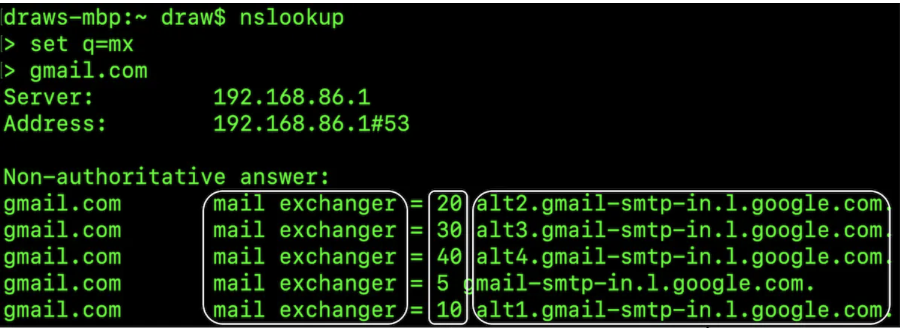
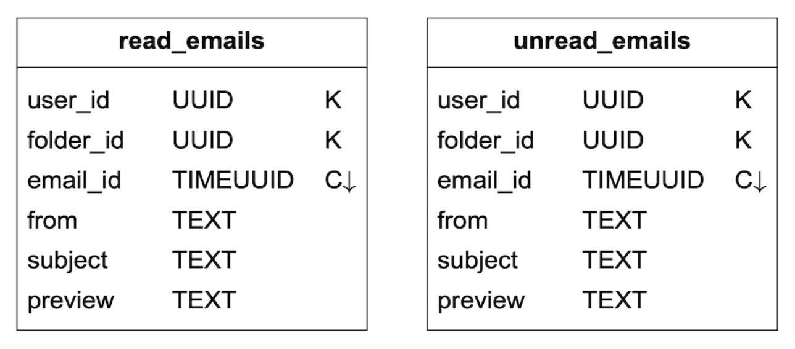

# 第 8 章 分布式邮件服务

在本章中，我们将设计一个类似 Gmail 的**分布式邮件服务**。

2020 年，Gmail 拥有 18 亿活跃用户，而 Outlook 在全球拥有 4 亿用户。

---

## 第 1 步 - 理解问题并确定设计范围

候选人：系统有多少用户？
面试官：10 亿用户。

候选人：我认为以下功能很重要——身份认证、发送/接收邮件、获取邮件、过滤邮件、搜索邮件以及反垃圾邮件保护。
面试官：很好的清单。目前先不考虑身份认证。

候选人：用户如何连接邮件服务器？
面试官：通常，邮件客户端通过 SMTP、POP、IMAP 连接，但在本题中我们使用 HTTP。

候选人：邮件可以有附件吗？
面试官：可以。

### 非功能需求

- 可靠性 —— 不应丢失数据
- 可用性 —— 应使用复制来防止单点故障，还应容忍部分系统故障
- 可扩展性 —— 随着用户群的增长，系统应能应对
- 灵活性与可扩展性 —— 系统应灵活且易于扩展新功能。这是我们选择 HTTP 而非 SMTP/其他邮件协议的原因之一

### 粗略估算

- 10 亿用户
- 假设每人每天发送 10 封邮件 → 每秒 10 万封邮件
- 假设每人每天接收 40 封邮件，每封邮件平均有 50KB 元数据 → 每年 730PB 存储
- 假设 20% 的邮件带有附件，平均大小为 500KB → 每年 1460PB

---

## 第 2 步 - 提出高层设计并获得认可

### 邮件基础知识

用于发送和接收邮件的协议有多种：
- SMTP —— 从一个服务器向另一个服务器发送邮件的标准协议。
- POP —— 从远程邮件服务器接收邮件并下载到本地客户端的标准协议。邮件被获取后，会从远程服务器删除。
- IMAP —— 与 POP 类似，用于从远程服务器接收和下载邮件，但邮件保留在服务器端。
- HTTPS —— 严格来说不是邮件协议，但可用于基于 Web 的邮件客户端。

除了邮件协议外，我们还需要为邮件服务器配置一些 DNS 记录——MX 记录：


图 8.1: DNS 查询

邮件附件以 base64 编码发送，大多数邮件服务通常有 25MB 的大小限制。该限制是可配置的，个人账户和企业账户有所不同。

### 传统邮件服务器

当用户数量有限且连接到单台服务器时，传统邮件服务器工作良好。


图 8.2: 传统邮件服务器

- Alice 登录她的 Outlook 邮箱并点击"发送"。邮件被发送到 Outlook 邮件服务器。通信通过 SMTP 进行。
- Outlook 服务器查询 DNS 以查找 gmail.com 的 MX 记录，并将邮件传输到对方的服务器。通信通过 SMTP 进行。
- Bob 通过 IMAP/POP 从他的 gmail 服务器获取邮件。

在传统邮件服务器中，邮件存储在本地文件系统上。每封邮件都是一个单独的文件。


图 8.3: 本地目录存储

随着规模增长，磁盘 I/O 成为瓶颈。此外，它也无法满足我们的高可用性和可靠性需求。磁盘可能损坏，服务器可能宕机。

### 分布式邮件服务器

分布式邮件服务器旨在支持现代使用场景并解决现代可扩展性问题。

这些服务器仍可支持原生邮件客户端的 IMAP/POP，以及跨服务器邮件交换的 SMTP。

但对于功能丰富的基于 Web 的邮件客户端，通常使用基于 HTTP 的 RESTful API。

示例 API：
- `POST /v1/messages` —— 向收件人（To、Cc、Bcc 头）发送消息。
- `GET /v1/folders` —— 返回邮件账户的所有文件夹。

示例响应：

```
[{id: string        文件夹的唯一标识符。
  name: string      文件夹名称。
                    根据 RFC6154 [9]，默认文件夹可以是以下之一：
                    All、Archive、Drafts、Flagged、Junk、Sent 和 Trash。
  user_id: string   对账户所有者的引用
}]
```

- `GET /v1/folders/{:folder_id}/messages` —— 返回某个文件夹下带分页的所有消息
- `GET /v1/messages/{:message_id}` —— 获取某条特定消息的所有信息

示例响应：

```
{
  user_id: string                      // 对账户所有者的引用。
  from: {name: string, email: string}  // 发件人的 <名称, 邮箱> 对。
  to: [{name: string, email: string}]  // <名称, 邮箱> 对列表
  subject: string                      // 邮件主题
  body: string                         // 邮件正文
  is_read: boolean                     // 指示消息是否已读。
}
```

以下是分布式邮件服务器的高层设计：


图 8.4: 高层架构

- Webmail —— 用户使用 Web 浏览器发送/接收邮件
- Web 服务器 —— 面向公众的请求/响应服务，用于管理登录、注册、用户资料等
- 实时服务器 —— 用于将新的邮件更新实时推送给客户端。我们使用 WebSocket 进行实时通信，对于不支持的老浏览器则回退到长轮询
- 元数据库 —— 存储邮件元数据，如主题、正文、发件人、收件人等
- 附件存储 —— 对象存储（如 Amazon S3），适合存储大文件
- 分布式缓存 —— 我们可以在 Redis 中缓存最近的邮件以改善用户体验
- 搜索存储 —— 分布式文档存储，用于支持全文搜索

以下是邮件发送流程：


图 8.5: 邮件发送流程

- 用户撰写邮件并点击"发送"。邮件被发送到负载均衡器。
- 负载均衡器对过量的邮件发送进行限流，并将请求路由到某个 Web 服务器。
- Web 服务器进行基本的邮件校验（如邮件大小），如果域名与发件人相同，则短路外发流程。但会先进行垃圾邮件检查。
- 如果基本校验通过，邮件被发送到消息队列（附件从对象存储引用）
- 如果基本校验失败，邮件被发送到错误队列
- SMTP 外发工作线程从外发队列拉取消息，进行垃圾邮件/病毒检查，并路由到目标邮件服务器
- 邮件存储在"已发送"文件夹中

我们还需要监控外发消息队列的大小。增长过大可能表明存在问题：
- 收件人的邮件服务器不可用。我们可以使用指数退避稍后重试发送邮件。
- 没有足够的消费者来处理负载，我们可能需要扩展消费者。

以下是邮件接收流程：


图 8.6: 邮件接收流程

- 传入的邮件到达 SMTP 负载均衡器。邮件被分发到 SMTP 服务器，在那里执行邮件接收策略（例如，无效邮件直接丢弃）。
- 如果邮件附件过大，我们可以将其放入对象存储（S3）。
- 邮件处理工作线程进行初步检查，之后邮件被转发到存储、缓存、对象存储和实时服务器。
- 离线用户在重新上线后通过 HTTP API 获取新邮件。

---

## 第 3 步 - 设计深入

现在让我们更深入地了解一些组件。

### 元数据库

以下是邮件元数据的一些特征：
- 邮件头通常较小且频繁访问
- 正文大小从小到很大不等，但通常只读取一次
- 大多数邮件操作都限定在单个用户范围内——例如获取邮件、标记已读、搜索
- 数据的新鲜度影响数据使用。用户通常只阅读最近的邮件
- 数据有高可靠性要求。数据丢失是不可接受的

在 Gmail/Outlook 规模下，数据库通常是定制开发的，以减少每秒输入/输出操作（IOPS）。

让我们考虑可用的数据库选项：
- 关系数据库 —— 我们可以为邮件头和正文建立索引，但这些数据库通常针对小块数据进行了优化
- 分布式对象存储 —— 作为备份存储是不错的选择，但无法高效支持搜索/标记已读等操作
- NoSQL —— Gmail 使用 Google BigTable，但它并未开源

基于以上分析，很少有现成的解决方案能完美满足我们的需求。
在面试场景中，设计一个全新的分布式数据库解决方案是不现实的，但重要的是提及其特征：
- 单列可以是数 MB 大小
- 强数据一致性
- 旨在减少磁盘 I/O
- 高可用和容错
- 应易于创建增量备份

为了对数据进行分区，我们可以使用 `user_id` 作为分区键，这样一个用户的数据存储在一个分片上。
这使我们无法在多个用户之间共享一封邮件，但这在本次面试中不是必需的需求。

让我们定义表：
- 主键由分区键（数据分布）和聚簇键（数据排序）组成
- 需要支持的查询——获取用户的所有文件夹、显示文件夹的所有邮件、创建/获取/删除邮件、获取已读/未读邮件、获取会话线程（加分项）

接下来表格的图例：


图 8.7: 图例

以下是文件夹表：


图 8.8: 文件夹表

邮件表：


图 8.9: 邮件表

- `email_id` 是 timeuuid，允许根据邮件创建时间进行排序

附件存储在单独的表中，以文件名标识：


图 8.10: 附件

在传统关系数据库中，支持获取已读/未读邮件很容易，但在 Cassandra 中则不然，因为不允许对非分区/聚簇键进行过滤。
一种变通方案是获取文件夹中的所有邮件并在内存中过滤，但这对于足够大的应用效果不佳。

我们可以做的是将邮件表反规范化为已读/未读邮件表：


图 8.11: 已读/未读邮件

为了支持会话线程，我们可以包含一些邮件头，邮件客户端会解析并使用这些头来重建会话线程：

```
{
  "headers" {
     "Message-Id": "<7BA04B2A-430C-4D12-8B57-862103C34501@gmail.com>",
     "In-Reply-To": "<CAEWTXuPfN=LzECjDJtgY9Vu03kgFvJnJUSHTt6TW@gmail.com>",
     "References": ["<7BA04B2A-430C-4D12-8B57-862103C34501@gmail.com>"]
  }
}
```

最后，对于我们的分布式数据库，我们将牺牲可用性换取一致性，因为这是本题的硬性要求。

因此，在发生故障转移或网络分区时，同步/更新操作将对受影响的用户暂时不可用。

### 邮件送达率

搭建一个发送邮件的服务器很容易，但由于反垃圾邮件算法，让邮件进入收件人的收件箱很难。

如果我们只是搭建一个新的邮件服务器并开始通过它发送邮件，我们的邮件很可能会进入垃圾邮件文件夹。

以下是我们可以采取的措施：
- 专用 IP —— 使用专用 IP 发送邮件，否则收件服务器不会信任你
- 邮件分类 —— 避免使用相同的服务器发送营销邮件，以防更重要的邮件被归类为垃圾邮件
- 逐步预热 IP 地址 —— 缓慢建立与大型邮件服务商的良好声誉。预热一个新 IP 需要 2 到 6 周时间
- 快速封禁垃圾邮件发送者 —— 以免损害你的声誉
- 反馈处理 —— 与 ISP 建立反馈循环，跟踪投诉率并快速封禁垃圾邮件账户
- 邮件身份认证 —— 使用常见技术来抵御网络钓鱼，如发件人策略框架（SPF）、域名密钥识别邮件（DKIM）等

你不需要记住所有这些。只需要知道，构建一个好的邮件服务器需要大量的领域知识。

### 搜索

搜索包括基于邮件内容的全文搜索，或基于发件人、收件人、主题、未读等过滤条件的更高级查询。

邮件搜索的一个特点是它只针对用户本人，并且写入多于读取，因为每次操作都需要重新建立索引，但用户很少使用搜索标签页。

让我们比较一下谷歌搜索和邮件搜索：

| | 范围 | 排序 | 准确性 |
|---|---|---|---|
| 谷歌搜索 | 整个互联网 | 按相关性排序 | 索引需要一些时间，因此结果不是即时的 |
| 邮件搜索 | 用户自己的邮箱 | 按属性排序，如时间、日期等 | 索引应快速，结果应准确 |

为了实现这种搜索功能，一种选择是使用 Elasticsearch 集群。我们可以使用 `user_id` 作为分区键，将数据分组到同一节点下：


图 8.12: Elasticsearch

变更操作通过 Kafka 异步进行，以将服务与重新索引流程解耦。
实际的搜索是同步进行的。

Elasticsearch 是最流行的搜索引擎数据库之一，对邮件的全文搜索支持得非常好。

或者，我们可以尝试开发自己的定制搜索解决方案来满足我们的特定需求。

设计这样一个系统超出了本书范围。构建它的核心挑战之一是针对写密集型工作负载进行优化。

为此，我们可以使用日志结构合并树（LSM）来组织磁盘上的索引数据。写入路径仅针对顺序写入进行优化。
这种技术被用于 Cassandra、BigTable 和 RocksDB。

其核心思想是将数据存储在内存中，直到达到预定义的阈值，之后将其合并到下一层（磁盘）：


图 8.13: LSM 树

两种方法之间的主要权衡：
- Elasticsearch 在一定程度上可扩展，而定制搜索引擎可以针对邮件用例进行精细调优，从而进一步扩展。
- Elasticsearch 是一个需要我们单独维护的服务，与元数据存储并存。定制解决方案可以就是数据存储本身。
- Elasticsearch 是现成的解决方案，而定制搜索引擎需要大量的工程工作来构建。

### 可扩展性与可用性

由于单个用户的操作不会与其他用户发生冲突，大多数组件可以独立扩展。

为了确保高可用性，我们还可以使用多数据中心设置，并在发生故障时进行主从故障转移：


图 8.14: 多数据中心示例

---

## 第 4 步 - 总结

其他可讨论的要点：
- 容错 —— 系统的许多部分可能发生故障。如何处理节点故障值得讨论。
- 合规性 —— 根据欧洲的 GDPR 法律，PII 需要以合理的方式存储。
- 安全性 —— 邮件加密、防钓鱼保护、安全浏览等。
- 优化 —— 例如防止不同用户多次发送的相同附件的重复存储。
