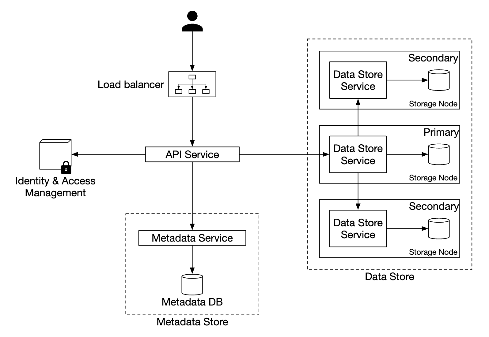
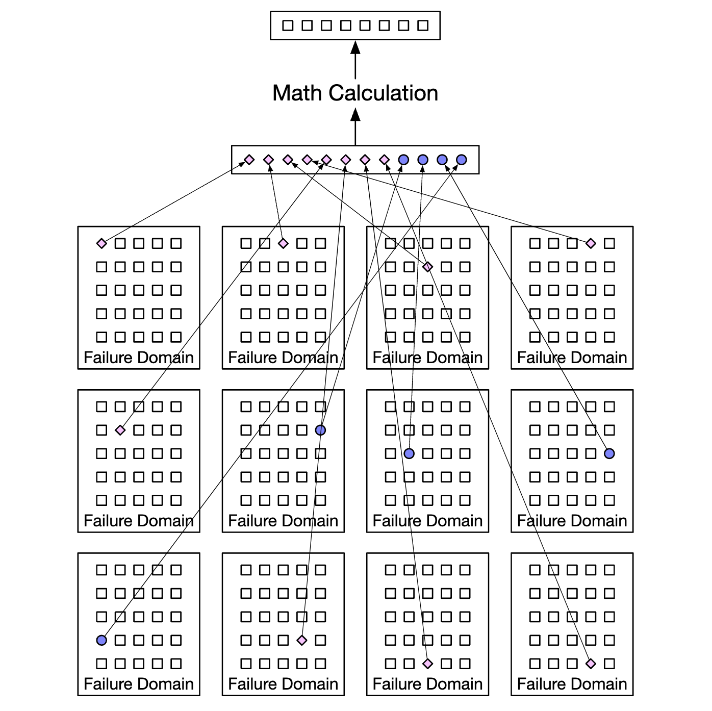

# 第 9 章 类 S3 对象存储

在本章中，我们将设计一个类似 Amazon S3 的**对象存储**服务。

存储系统大致分为三类：
- 块存储
- 文件存储
- 对象存储

**块存储**是 20 世纪 60 年代出现的设备。HDD 和 SSD 就是此类例子。这些设备通常物理连接到服务器，不过它们也可以通过高速网络协议进行网络连接。服务器可以格式化原始块并将其用作文件系统，也可以将它们的控制权直接交给服务器。

**文件存储**构建在块存储之上。它提供了更高层次的抽象，使管理文件夹和文件更加容易。

**对象存储**以性能为代价换取高持久性、大规模和低成本。它面向"冷"数据，主要用于归档和备份。它没有分层目录结构，所有数据都以扁平结构存储为对象。与其他存储类型相比，它相对较慢。大多数云服务商都有对象存储产品——Amazon S3、Google GCS 等。


图 9.1: 存储比较

| | 块存储 | 文件存储 | 对象存储 |
|---|---|---|---|
| 可变内容 | 是 | 是 | 否（有对象版本控制）|
| 成本 | 高 | 中到高 | 低 |
| 性能 | 中到高，非常高 | 中到高 | 低到中 |
| 一致性 | 强一致性 | 强一致性 | 强一致性 [5] |
| 数据访问 | SAS/iSCSI/FC | 标准文件访问、CIFS/SMB 和 NFS | RESTful API |
| 可扩展性 | 中等可扩展性 | 高可扩展性 | 大规模可扩展性 |
| 适用场景 | 虚拟机（VM）、数据库 | 通用文件系统访问 | 二进制数据、非结构化数据 |

与对象存储相关的一些术语：
- 桶（Bucket）—— 对象的逻辑容器。名称全局唯一。
- 对象（Object）—— 存储在桶中的单个数据片段。包含对象数据和元数据。
- 版本控制（Versioning）—— 在同一桶中保留对象多个变体的功能。
- 统一资源标识符（URI）—— 每个资源由 URI 唯一标识。
- 服务等级协议（SLA）—— 服务提供方与客户之间的契约。

Amazon S3 标准-不频繁访问存储类别的 SLA：
- 跨多个可用区的持久性为 99.999999999%
- 即使整个可用区被摧毁，数据仍具有韧性
- 设计目标为 99.9% 可用性

---

## 第 1 步 - 理解问题并确定设计范围

候选人：应该包含哪些功能？
面试官：创建桶、对象上传/下载、版本控制、列出桶中的对象。

候选人：典型的数据大小是多少？
面试官：我们需要高效地存储大对象和小对象。

候选人：我们每年存储多少数据？
面试官：100 PB。

候选人：我们能否假设数据持久性达到 6 个 9（99.9999%），服务可用性达到 4 个 9（99.99%）？
面试官：可以，这听起来很合理。

### 非功能需求

- 100 PB 数据
- 6 个 9 的数据持久性
- 4 个 9 的服务可用性
- 存储效率。在保持高可靠性和性能的同时降低存储成本

### 粗略估算

对象存储的瓶颈可能在磁盘容量或每秒 IO（IOPS）上。

假设：
- 我们有 20% 的小对象（小于 1MB）、60% 的中型对象（1-64MB）和 20% 的大对象（大于 64MB）
- 一块硬盘（SATA，7200rpm）每秒能进行 100-150 次随机寻道（100-150 IOPS）

根据这些假设，我们可以估算系统能够持久化的对象总数。
- 让我们使用每种对象类型的中位数大小来简化计算——小对象 0.5MB，中型 32MB，大型 200MB。
- 给定 100PB 存储（10^11 MB）和 40% 的存储使用率，可得到 6.8 亿个对象
- 如果我们假设元数据为 1KB，那么我们需要 0.68TB 的空间来存储元数据信息

---

## 第 2 步 - 提出高层设计并获得认可

在深入设计之前，让我们先探索对象存储的一些有趣特性：
- 对象不可变性 —— 对象存储中的对象是不可变的（其他存储系统则不然）。我们可以删除或替换它们，但不能更新。
- 键值存储 —— 对象的 URI 就是它的键，我们可以通过发起 HTTP 调用来获取其内容
- 一次写入、多次读取 —— 数据访问模式是写入一次、读取多次。根据 LinkedIn 的一些研究，95% 的操作是读取
- 同时支持小对象和大对象

对象存储的设计理念类似于 UNIX——当我们保存一个文件时，它在一个称为 inode 的数据结构中创建文件名，而文件数据存储在不同的磁盘位置。inode 包含一个文件块指针列表，这些指针指向磁盘上的不同位置。

访问文件时，我们先从 inode 获取其元数据，然后再获取文件内容。

对象存储的工作方式类似——元数据存储用于保存文件信息，但内容存储在磁盘上：


图 9.2: 对象存储 vs UNIX

通过将元数据与文件内容分离，我们可以独立扩展不同的存储：


图 9.3: 桶与对象

### 高层设计


图 9.4: 高层设计

- 负载均衡器 —— 在服务副本之间分发 API 请求
- API 服务 —— 无状态服务器，协调对元数据存储、对象存储以及 IAM 服务的调用
- 身份与访问管理（IAM）—— 认证、授权和访问控制的中心位置
- 数据存储 —— 存储和检索实际数据。操作基于对象 ID（UUID）
- 元数据存储 —— 存储对象元数据

### 上传对象


图 9.5: 上传对象

- 通过 HTTP PUT 请求创建名为 "bucket-to-share" 的桶
- API 服务调用 IAM 确保用户已授权并具有写入权限
- API 服务调用元数据存储创建桶条目。创建完成后，返回成功响应
- 桶创建后，发送 HTTP PUT 创建名为 "script.txt" 的对象
- API 服务验证用户身份并确保用户具有写入权限
- 校验通过后，对象载荷通过 HTTP PUT 发送到数据存储。数据存储持久化它并返回 UUID
- API 服务调用元数据存储，创建一条新记录，包含 `object_id`、`bucket_id` 和 `bucket_name` 以及其他元数据

对象上传请求示例：

```
PUT /bucket-to-share/script.txt HTTP/1.1
Host: foo.s3example.org
Date: Sun, 12 Sept 2021 17:51:00 GMT
Authorization: authorization string
Content-Type: text/plain
Content-Length: 4567
x-amz-meta-author: Alex

[4567 bytes of object data]
```

### 下载对象

桶没有目录层级，但我们可以通过拼接桶名和对象名来创建逻辑层级，以模拟文件夹结构。

获取对象的 GET 请求示例：

```
GET /bucket-to-share/script.txt HTTP/1.1
Host: foo.s3example.org
Date: Sun, 12 Sept 2021 18:30:01 GMT
Authorization: authorization string
```


图 9.6: 下载对象

- 客户端向负载均衡器发送 HTTP GET 请求，即 `GET /bucket-to-share/script.txt`
- API 服务查询 IAM 验证用户是否有读取该桶的正确权限
- 校验通过后，从元数据存储获取对象的 UUID
- 根据 UUID 从数据存储获取对象载荷并返回给客户端

---

## 第 3 步 - 设计深入

### 数据存储

以下是 API 服务与数据存储交互的方式：


图 9.7: 数据存储交互

数据存储的主要组件：


图 9.8: 数据存储主要组件

数据路由服务提供 RESTful 或 gRPC API 来访问数据节点集群。它是一个无状态服务，通过增加服务器来扩展。

它的主要职责是：
- 查询放置服务以获取存储数据的最佳数据节点
- 从数据节点读取数据并返回给 API 服务
- 向数据节点写入数据

放置服务决定哪些数据节点应该存储某个对象。它维护一个虚拟集群映射，该映射决定集群的物理拓扑。


图 9.9: 虚拟集群映射

该服务还向所有数据节点发送心跳，以确定是否应将它们从虚拟集群中移除。

由于这是一个关键服务，建议维护一个由 5 或 7 个副本组成的集群，通过 Paxos 或 Raft 共识算法进行同步。例如，一个 7 节点的集群可以容忍 3 个节点故障。

数据节点存储实际的对象数据。通过将数据复制到多个数据节点来确保可靠性和持久性。

每个数据节点都有一个守护进程在运行，它向放置服务发送心跳。

心跳包含：
- 该数据节点管理多少块磁盘（HDD 或 SSD）？
- 每块磁盘上存储了多少数据？

#### 数据持久化流程


图 9.10: 数据持久化流程

- API 服务将对象数据转发到数据存储
- 数据路由服务将数据发送到主数据节点
- 主数据节点在本地保存数据，并将其复制到两个次级数据节点。成功复制后发送响应
- 对象的 UUID 返回给 API 服务

注意事项：
- 给定对象 UUID，其复制组通过一致性哈希确定性地选择
- 在第 4 步中，主数据节点在返回响应之前复制对象数据。这偏向于强一致性而非更低的延迟


图 9.11: 一致性 vs 延迟

#### 数据如何组织

一种管理数据的简单方法是将每个对象存储在单独的文件中。

这种方法可行，但在文件系统中有许多小文件时性能不佳：
- HDD 上的数据块被浪费，因为每个文件都占用整个块大小。典型块大小为 4KB
- 文件多意味着 inode 多。操作系统对过多的 inode 处理不佳，并且存在 inode 数量上限

这些问题可以通过写前日志（WAL）将许多小文件合并成更大的文件来解决。一旦文件达到其容量（通常几 GB），就创建新文件：


图 9.12: WAL 优化

这种方法的缺点是文件写入访问需要串行化。访问同一文件的多个核心必须相互等待。为了解决这个问题，我们可以将文件限制在特定核心上，以避免锁竞争。

#### 对象查找

为了支持在同一文件中存储多个对象，我们需要维护一个表，告诉数据节点：
- `object_id`
- 存储对象的 `filename`
- 对象起始的 `file_offset`
- `object_size`

我们可以将该表部署在基于文件的数据库（如 RocksDB）或传统关系数据库中。由于访问模式是低写入 + 高读取，关系数据库效果更好。

我们应该如何部署它？
我们可以将数据库单独部署在一个集群中扩展，供所有数据节点访问。

缺点：
- 我们需要积极扩展集群以服务所有请求
- 数据节点和数据库集群之间存在额外的网络延迟

另一种选择是利用数据节点只关心与自己相关数据这一事实，因此我们可以在数据节点内部部署关系数据库。

SQLite 是一个不错的选择，因为它是一个轻量级的基于文件的关系数据库。

#### 更新后的数据持久化流程


图 9.13: 更新后的数据持久化流程

- API 服务发送保存新对象的请求
- 数据节点服务将新对象追加到名为 "/data/c" 的文件末尾
- 在对象映射表中插入该对象的新记录

#### 持久性

数据持久性是我们设计中的一个重要需求。为了达到 6 个 9 的持久性，需要仔细检查每一种故障情况。

首先要解决的是硬件故障。我们可以通过复制数据节点来最小化故障概率。
但除此之外，我们还应该跨不同的故障域进行复制（跨机架、跨数据中心、独立网络等）。一个关键事件可能导致同一域内的多个硬件同时故障：


图 9.14: 故障域隔离

假设典型 HDD 的年故障率为 0.81%，制作三份副本可给我们 6 个 9 的持久性。

像这样复制数据节点可以给我们想要的持久性，但我们也可以利用纠删码来降低存储成本。

纠删码使我们能够使用校验位，从而在发生故障时重建丢失的位：


图 9.15: 纠删码

想象这些位就是数据节点。如果其中两个宕机，它们可以使用剩余的四个进行恢复。

纠删码有不同的方案。在我们的场景中，我们可以使用 8+4 纠删码，跨不同故障域拆分以最大化可靠性：


图 9.16: 跨故障域的纠删码

纠删码使我们能够实现低得多的存储成本（改善 50%），代价是访问速度，因为数据路由服务需要从多个位置收集数据：


图 9.17: 纠删码 vs 复制

其他注意事项：
- 复制需要 200% 的存储开销（3 个副本的情况）vs 纠删码的 50%
- 纠删码提供 11 个 9 的持久性（见 Backblaze 的[纠删码持久性研究](https://github.com/Backblaze/erasure-coding-durability)）vs 复制的 6 个 9
- 纠删码需要更多的计算来生成和存储校验位

总而言之，复制更适合对延迟敏感的应用，而纠删码在存储成本效率和持久性方面更具吸引力。纠删码的实现也困难得多。

#### 正确性校验

如果磁盘完全故障，那么故障很容易检测。但如果磁盘的部分内存损坏，情况就不那么直接了。

为了检测这种情况，我们可以使用校验和——文件内容的哈希，可用于验证文件的完整性。

在我们的场景中，我们将为每个文件和每个对象存储校验和：


图 9.18: 用于正确性校验的校验和

在纠删码（8+4）的情况下，我们需要分别获取 8 块数据中的每一块，并验证各自的校验和。

### 元数据数据模型

表结构：


图 9.19: 元数据数据模型

需要支持的查询：
- 按名称查找对象 ID
- 按名称插入/删除对象
- 列出桶中共享相同前缀的对象

用户可创建的桶数量通常有限制，因此桶表很小，可以放入单个数据库服务器。但我们仍需要扩展服务器以满足读取吞吐量。

对象表可能无法放入单个数据库服务器，因此我们可以通过分片来扩展该表：
- 按 `bucket_id` 分片会导致热点问题，因为一个桶可能有数十亿个对象
- 按 `object_id` 分片使负载分布更均匀，但我们的查询会变慢
- 我们选择按 `hash(bucket_name, object_name)` 分片，因为大多数查询基于对象/桶名称

不过，即使使用这种分片方案，列出桶中的对象仍然会很慢。

### 列出桶中的对象

在单个数据库中，根据前缀（看起来像目录）列出对象是这样工作的：

```
SELECT * FROM object WHERE bucket_id = "123" AND object_name LIKE `abc/%`
```

当数据库被分片时，这很难实现。为了实现它，我们可以在每个分片上运行查询并在内存中聚合结果。但这使分页变得困难，因为不同的分片包含不同的结果大小，我们需要为每个分片维护单独的 limit/offset。

我们可以利用对象存储通常不针对列出对象进行优化这一事实，因此可以牺牲列出性能。
我们还可以创建一个用于列出对象的反规范化表，按桶 ID 分片。这将使我们的列出查询足够快，因为它被隔离在单个数据库实例中。

### 对象版本控制

版本控制通过另一个 `object_version` 列来实现，其类型为 TIMEUUID，使我们能够基于它对记录进行排序。

每个新版本都会产生一个新的 `object_id`：


图 9.20: 对象版本控制

删除对象会创建一个新版本，其 `object_id` 特殊，表示该对象已被删除。对其的查询返回 404：


图 9.21: 删除带版本的对象

### 优化大文件上传

大文件上传可以通过分段上传来优化——将大文件拆分为多个块，独立上传：


图 9.22: 分段上传

- 客户端调用服务以启动分段上传
- 数据存储返回一个唯一标识该上传的上传 ID
- 客户端将大文件拆分为多个块，使用上传 ID 独立上传
- 当一个块上传后，数据存储返回一个 etag，它是一个 md5 校验和，用于标识该上传块
- 所有分片上传完成后，客户端发送完成分段上传的请求，包含 upload_id、分片编号和所有 etag
- 数据存储从各个分片重组对象。此过程可能需要几分钟。之后，向客户端返回成功响应

此时可以移除不再有用的旧分片。我们可以引入垃圾回收器来处理。

### 垃圾回收

垃圾回收是回收不再使用的存储空间的过程。数据变成垃圾的几种方式：
- 惰性对象删除 —— 对象被标记为已删除，但并未真正删除
- 孤儿数据 —— 例如上传中途失败，旧分片需要被删除
- 损坏的数据 —— 校验和验证失败的数据

垃圾回收器还负责回收副本中未使用的空间。
使用复制时，数据从主节点和副本中都删除。使用纠删码（8+4）时，数据从全部 12 个节点删除。

为了便于删除，我们使用一种称为压缩（compaction）的过程：
- 垃圾回收器将未删除的对象从 "data/b" 复制到 "data/d"
- 复制完成后，使用数据库事务更新 `object_mapping` 表
- 为了避免产生过多小文件，压缩针对增长超过一定阈值的文件进行


图 9.23: 压缩

---

## 第 4 步 - 总结

我们涵盖的内容：
- 设计一个类 S3 对象存储
- 比较对象、块和文件存储之间的差异
- 涵盖桶中对象的上传、下载、列出、版本控制
- 深入设计——数据存储和元数据存储、复制和纠删码、分段上传、分片
